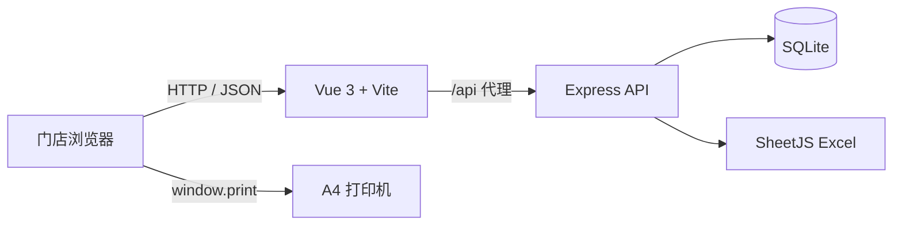

# 联想门店商品标签打印系统（LSLP）

面向联想门店店员的商品信息管理与标签打印工具。系统可以维护商品 SKU、名称、配置、颜色和备注，按商品独立设置打印数量，并将标签实时排版到 A4 页面中。每张标签的实际尺寸为 **46mm × 45mm**，打印后可直接裁剪并粘贴。

## 目录

- [主要功能](#主要功能)
- [界面与打印规格](#界面与打印规格)
- [技术架构](#技术架构)
- [项目结构](#项目结构)
- [环境要求](#环境要求)
- [安装与启动](#安装与启动)
- [日常使用](#日常使用)
- [Excel 导入导出](#excel-导入导出)
- [数据备份与恢复](#数据备份与恢复)
- [API 文档](#api-文档)
- [数据库设计](#数据库设计)
- [打印设置](#打印设置)
- [构建与验证](#构建与验证)
- [故障排查](#故障排查)
- [安全与维护](#安全与维护)

## 主要功能

### 商品管理

- 新增、编辑、复制新增和删除商品
- 新增时支持“保存并新增”，可连续录入多件商品
- 批量删除当前已选商品
- SKU 唯一性校验
- 输入关键字后自动按 SKU、商品名称或配置信息进行模糊筛选
- 支持颜色和备注为空

### 标签管理

- 页面加载后默认选择全部商品
- 每个 SKU 独立维护打印数量，默认数量为 1
- 修改数量或选择状态后实时更新预览
- 顶栏和底栏实时显示商品数、已选数、标签数与页数
- 未选择商品时自动禁用打印按钮

### 文件与数据

- 按模板导入 `.xlsx` 或 `.xls` 文件
- 根据 SKU 自动新增或更新商品
- 导入完成后显示成功数、失败数和错误行
- 导出全部商品为 `.xlsx` 文件
- 下载完整 SQLite `.db` 数据库备份
- 恢复前验证 SQLite 完整性和 `products` 表结构

## 界面与打印规格

| 项目 | 规格 |
| --- | --- |
| 页面布局 | 左侧商品管理 52%，右侧 A4 预览 48% |
| 左侧最小宽度 | 460px |
| 标签尺寸 | 46mm × 45mm |
| 标签边框 | 1px 黑色实线 |
| 标签内边距 | 2mm |
| 每页数量 | 24 个（4 列 × 6 行） |
| A4 页面边距 | 8mm |
| 水平标签间距 | 3mm |
| 垂直标签间距 | 2.2mm |
| 颜色块 | 14mm 高、黑底白字、24pt、900 字重 |
| SKU | 8pt、灰色 |
| 商品名称 | 13pt、700 字重 |
| 配置信息 | 8pt、700 字重、自动换行 |

> **垂直间距说明：** 6 个 45mm 标签、5 个 3mm 间距和上下各 8mm 边距合计为 301mm，超过 A4 的 297mm 高度。为了同时保证 45mm 标签高度、8mm 页面边距和每页 6 行，系统将垂直间距调整为 2.2mm；水平方向仍使用 3mm。

## 技术架构



### 前端

| 技术 | 固定版本 | 用途 |
| --- | --- | --- |
| Vue | 3.4.38 | 响应式界面和组件 |
| Vite | 5.4.19 | 开发服务器与生产构建 |
| Element Plus | 2.6.3 | 表格、表单、弹窗、消息等 UI |
| Axios | 1.6.8 | API 与文件请求 |

### 后端

| 技术 | 固定版本 | 用途 |
| --- | --- | --- |
| Node.js | 20.20.2 | JavaScript 运行环境 |
| Express | 4.21.2 | REST API 服务 |
| better-sqlite3 | 9.6.0 | 同步 SQLite 数据访问 |
| SheetJS xlsx | 0.18.5 | Excel 解析与生成 |
| Multer | 1.4.5-lts.1 | Excel 和数据库文件上传 |
| CORS | 2.8.5 | 开发环境跨域支持 |

## 项目结构

```text
Lenovo Store Label Printer System/
├── .nvmrc                         # 项目 Node.js 版本
├── .gitignore
├── README.md
├── backend/
│   ├── db/
│   │   ├── database.js            # 数据库连接、建表、备份恢复
│   │   └── database.sqlite        # 运行时自动创建，不提交到 Git
│   ├── routes/
│   │   ├── products.js            # 商品和 Excel API
│   │   └── backup.js              # 数据库备份恢复 API
│   ├── uploads/                   # 临时上传目录
│   ├── server.js                  # Express 入口，默认端口 3000
│   ├── package.json
│   └── package-lock.json
└── frontend/
    ├── src/
    │   ├── components/
    │   │   ├── AppHeader.vue
    │   │   ├── LeftPanel.vue
    │   │   ├── PreviewPanel.vue
    │   │   └── ProductModal.vue
    │   ├── App.vue                # 页面状态和业务流程
    │   ├── api.js                 # Axios API 封装
    │   ├── main.js
    │   └── styles.css             # 页面、标签和打印样式
    ├── index.html
    ├── vite.config.js
    ├── package.json
    └── package-lock.json
```

## 环境要求

- Windows 10/11 或 macOS 11+
- Node.js 18 或 20，推荐使用项目指定的 **Node.js 20.20.2**
- npm 9+
- Chrome 90+、Edge 90+、Firefox 88+ 或 Safari 14+
- 可打印 A4 纸张的打印机

如果机器已安装 NVM，在项目根目录执行：

```bash
nvm use
```

NVM 会读取 `.nvmrc` 并切换到 Node.js 20.20.2。未安装该版本时执行：

```bash
nvm install 20.20.2
nvm use 20.20.2
```

## 安装与启动

### 1. 获取代码

```bash
git clone <repository-url>
cd "Lenovo Store Label Printer System"
nvm use
```

### 2. 安装后端依赖

```bash
cd backend
npm install
```

`better-sqlite3` 包含原生模块。如果切换过 Node.js 版本或 CPU 架构后出现 `ERR_DLOPEN_FAILED`，执行：

```bash
npm rebuild better-sqlite3
```

### 3. 安装前端依赖

```bash
cd ../frontend
npm install
```

### 4. 启动后端

在第一个终端执行：

```bash
cd backend
npm start
```

后端地址：`http://localhost:3000`
健康检查：`http://localhost:3000/api/health`

### 5. 启动前端

在第二个终端执行：

```bash
cd frontend
npm run dev
```

浏览器访问：`http://localhost:5173`

Vite 默认监听 `0.0.0.0`。同一局域网内的其他设备可以通过开发机 IP 和端口 `5173` 访问，但后端和防火墙仍需允许相应连接。

## 日常使用

### 添加商品

1. 点击“新增商品”。
2. 填写必填的 SKU 和商品名称。
3. 根据需要填写配置、颜色和备注。
4. 点击“保存”完成当前新增并关闭弹窗；新增商品会自动加入打印选择，数量初始化为 1。
5. 需要连续录入时点击“保存并新增”。当前商品保存成功后，弹窗保持打开并切换到一张空白表单，SKU 输入框自动获得焦点。

### 复制新增商品

1. 在商品行的操作列点击“复制”。
2. 系统会打开“复制新增商品”弹窗，并预填原商品的名称、配置、颜色和备注。
3. 为避免违反 SKU 唯一约束，复制时不会沿用原 SKU；填写新 SKU 后可继续调整其他字段。
4. 点击“保存”完成复制新增，或点击“保存并新增”继续录入下一件商品。

### 搜索商品

在搜索框输入内容后，系统会等待约 300ms 并自动筛选，无需按 Enter 或点击“搜索”。筛选使用包含式模糊匹配，可匹配 SKU、商品名称或配置信息中的任意片段；快速连续输入时只采用最新关键字的查询结果。搜索只改变左侧显示结果，不会清空已选择的其他商品或打印数量。清空输入框后自动恢复完整商品列表。

### 设置打印内容

1. 使用每行左侧复选框选择或取消商品。
2. 使用数量输入框设置每个商品需要打印的标签数，范围为 1～999。
3. 在右侧确认分页、文字和颜色。
4. 点击“打印标签”。

### 删除商品

- 单条删除：点击商品行末尾的“删除”。
- 批量删除：选择商品后点击“批量删除”。

> 商品选择同时用于标签打印和批量删除。执行批量删除前请仔细确认弹窗中的数量。

## Excel 导入导出

### 模板格式

第一行必须是字段名，字段顺序可以任意：

| sku | name | config | color | remark |
| --- | --- | --- | --- | --- |
| 28976 | Legion Y7000 | C7 245HX / 16G / 1T / 5060 | 黑色/白色 |  |

规则：

- `sku`：必填，作为新增或更新判断依据。
- `name`：必填。
- `config`、`color`、`remark`：可选。
- 已存在的 SKU 会更新原商品。
- 不存在的 SKU 会新增商品。
- SKU 或名称为空的行会跳过，并在导入结果中标明 Excel 行号和原因。
- 单个上传文件最大 10MB。

### 导入

点击“导入 Excel”，选择 `.xlsx` 或 `.xls` 文件。导入结束后页面重新加载全部商品并默认全选。

### 导出

点击“导出 Excel”，浏览器将下载：

```text
products_YYYYMMDD_HHMMSS.xlsx
```

导出列固定为 `sku`、`name`、`config`、`color`、`remark`。

## 数据备份与恢复

### 备份

点击“备份数据”，系统通过 SQLite 在线备份 API 生成一致性备份并下载：

```text
database_YYYYMMDD_HHMMSS.db
```

建议在以下操作前备份：

- 大批量导入
- 批量删除
- 软件升级
- 更换电脑

### 恢复

1. 点击“恢复数据”。
2. 选择之前下载的 `.db` 文件。
3. 阅读覆盖提示并确认。
4. 系统检查 SQLite 完整性、`products` 表及必要字段。
5. 校验通过后替换当前数据库并刷新商品列表。

上传数据库文件最大 100MB。恢复失败时后端会尝试回滚到替换前的数据库。

## API 文档

基础地址：`http://localhost:3000/api`

统一 JSON 成功响应：

```json
{
  "code": 0,
  "data": {},
  "msg": "success"
}
```

统一 JSON 错误响应：

```json
{
  "code": 1,
  "data": null,
  "msg": "错误信息"
}
```

| 方法 | 路径 | 说明 |
| --- | --- | --- |
| GET | `/health` | 服务健康检查 |
| GET | `/products?q=keyword` | 查询或搜索商品 |
| POST | `/products` | 新增商品 |
| PUT | `/products/:id` | 更新商品 |
| DELETE | `/products/:id` | 删除商品 |
| POST | `/products/batch-delete` | 批量删除商品 |
| POST | `/products/import` | 导入 Excel |
| GET | `/products/export` | 导出 Excel |
| GET | `/backup` | 下载数据库备份 |
| POST | `/restore` | 恢复数据库 |

### 新增或更新请求体

```json
{
  "sku": "28976",
  "name": "Legion Y7000",
  "config": "C7 245HX / 16G / 1T / 5060",
  "color": "黑色/白色",
  "remark": ""
}
```

### 批量删除请求体

```json
{
  "ids": [1, 2, 3]
}
```

### 文件上传

Excel 导入和数据库恢复均使用 `multipart/form-data`，文件字段名为 `file`。

## 数据库设计

数据库文件：`backend/db/database.sqlite`

```sql
CREATE TABLE IF NOT EXISTS products (
  id INTEGER PRIMARY KEY AUTOINCREMENT,
  name TEXT NOT NULL,
  config TEXT,
  color TEXT,
  sku TEXT UNIQUE NOT NULL,
  remark TEXT,
  created_at TEXT DEFAULT (datetime('now')),
  updated_at TEXT DEFAULT (datetime('now'))
);

CREATE INDEX IF NOT EXISTS idx_products_sku ON products(sku);
CREATE INDEX IF NOT EXISTS idx_products_name ON products(name);
```

数据库在后端首次启动时自动创建。项目启用了 WAL 日志模式，正常备份应通过页面“备份数据”功能完成，不建议在服务运行时直接复制数据库及其旁路文件。

## 打印设置

推荐使用 Chrome 或 Edge：

1. 纸张选择 **A4**。
2. 布局选择 **纵向**。
3. 缩放设置为 **100%** 或“实际大小”。
4. 边距选择 **无**。
5. 关闭浏览器“页眉和页脚”。
6. 开启“背景图形”，以确保颜色块打印为黑底白字。
7. 首次使用时先打印一页并用尺子检查标签是否为 46mm × 45mm。

应用打印样式会自动：

- 隐藏顶栏、商品表格、按钮和预览信息栏。
- 取消屏幕预览缩放。
- 使用 A4 实际毫米尺寸。
- 每个预览页强制生成一个打印页。
- 保留标签边框和颜色块。

打印机驱动如果启用了“适合页面”或二次缩放，实际标签尺寸可能发生变化，应关闭驱动缩放。

## 构建与验证

### 后端语法检查

```bash
cd backend
npm run check
```

### 前端生产构建

```bash
cd frontend
npm run build
```

构建输出位于 `frontend/dist/`，该目录不会提交到 Git。

当前开发版本已经验证：

- Node.js 20.20.2 下后端语法检查通过。
- Vite 生产构建通过。
- 商品 CRUD、重复 SKU、搜索通过。
- Excel 导入和导出通过。
- 数据库备份、恢复及完整性检查通过。
- 冒烟验证产生的临时商品已清理。

## 故障排查

### 前端显示网络错误

确认后端已经启动，并检查：

```text
http://localhost:3000/api/health
```

开发模式下，Vite 会把 `/api` 请求代理到 `http://localhost:3000`。

### 端口被占用

后端可临时指定其他端口：

```bash
PORT=3100 npm start
```

如果修改后端端口，还需同步修改 `frontend/vite.config.js` 中的代理地址。

### better-sqlite3 无法加载

如果错误包含 `ERR_DLOPEN_FAILED`、`NODE_MODULE_VERSION` 或架构不兼容：

```bash
nvm use
cd backend
npm rebuild better-sqlite3
```

仍未解决时删除 `backend/node_modules`，在 Node.js 20 下重新执行 `npm install`。

### 标签打印尺寸不正确

- 确认 A4、纵向、100% 缩放。
- 关闭“适合纸张”或“缩小过大页面”。
- 设置浏览器边距为无。
- 检查打印机驱动是否再次缩放。

### 黑色颜色块没有打印

在浏览器打印设置中开启“背景图形”或“打印背景”。系统已设置 `print-color-adjust: exact`，但最终仍受浏览器和打印机设置控制。

### Excel 导入全部失败

确认首行包含小写字段名 `sku` 和 `name`。系统读取字段名时不区分大小写，但字段名称不能使用中文别名。

## 安全与维护

- 系统设计用于受信任的门店内网环境，目前不包含登录和权限控制。
- 不建议直接暴露到公网。
- 数据库备份可能包含门店商品数据，应存放在受控目录。
- 上传文件会在处理后删除，异常情况下可检查并清理 `backend/uploads/`。
- `node_modules`、构建产物、数据库和临时上传文件均已加入 `.gitignore`。
- 当前技术版本遵循项目原始约束。`xlsx 0.18.5` 和 `multer 1.x` 会产生 npm 安全审计提示，后续升级前应先验证 Excel 兼容性和上传接口行为。

## License

当前仓库未声明开源许可证，仅供项目所有者和获授权的联想门店内部使用。未经授权请勿分发。
